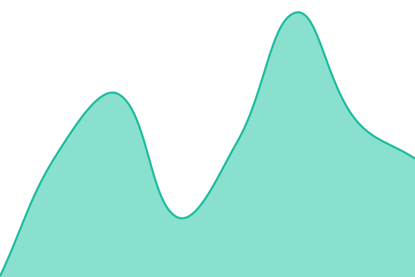
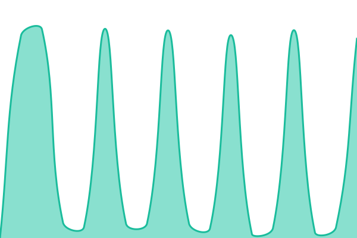

# IDCerberus Status

**Status atual:** <!--live status--> **Todos os serviços estão operacionais**

[Acessar status page](https://react-it.github.io/IDCerberus-Status-Page/)

Este repositório centraliza o monitoramento público do **IDCerberus** com [Upptime](https://upptime.js.org/). O projeto usa GitHub Actions para verificar disponibilidade, GitHub Pages para publicar a página de status e GitHub Issues para registrar incidentes automaticamente quando necessário.

## Serviços monitorados

- **Site Institucional**: `https://idcerberus.com`
- **Backoffice Produção**: `https://backoffice.idcerberus.com/`
- **Backoffice Homologação**: `https://backoffice-hml.idcerberus.com/`

## Como funciona

- O `Uptime CI` verifica periodicamente os serviços configurados em `.upptimerc.yml`.
- O `Summary CI` atualiza os arquivos em `history/`, `api/` e este `README.md`.
- O `Static Site CI` recompila a interface pública da status page.
- Quando um serviço falha, o Upptime pode abrir um incidente automaticamente no GitHub.

## Painel automático

<!--start: status pages-->
<!-- This summary is generated by Upptime (https://github.com/upptime/upptime) -->
<!-- Do not edit this manually, your changes will be overwritten -->
<!-- prettier-ignore -->
| URL | Status | History | Tempo de resposta | Disponibilidade |
| --- | ------ | ------- | ------------- | ------ |
|  [Site Institucional](https://idcerberus.com) | Operacional | [site-institucional.yml](https://github.com/React-it/IDCerberus-Status-Page/commits/HEAD/history/site-institucional.yml) | 

 772ms
     
 | 

<a href="https://React-it.github.io/IDCerberus-Status-Page/history/site-institucional">100.00%</a>
    

|  [Backoffice Produção](https://backoffice.idcerberus.com/) | Operacional | [backoffice-producao.yml](https://github.com/React-it/IDCerberus-Status-Page/commits/HEAD/history/backoffice-producao.yml) | 

 282ms
     
 | 

<a href="https://React-it.github.io/IDCerberus-Status-Page/history/backoffice-producao">100.00%</a>
    

|  [Backoffice Homologação](https://backoffice-hml.idcerberus.com/) | Operacional | [backoffice-homologacao.yml](https://github.com/React-it/IDCerberus-Status-Page/commits/HEAD/history/backoffice-homologacao.yml) | 

 2159ms
     
 | 

<a href="https://React-it.github.io/IDCerberus-Status-Page/history/backoffice-homologacao">35.62%</a>
    

<!--end: status pages-->

## Estrutura

- `/.upptimerc.yml`: configuração principal do Upptime
- `/history`: histórico bruto das verificações
- `/api`: JSON consumido pela status page
- `/graphs`: gráficos gerados automaticamente
- `/assets`: logo e customizações visuais

## Licença

- Código base: [MIT](./LICENSE)
- Dados em `history/`: [Open Database License](https://opendatacommons.org/licenses/odbl/1-0/)
- Infra de monitoramento: [Upptime](https://github.com/upptime/upptime)
