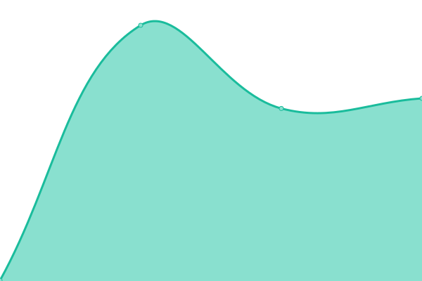

# [📈 Live Status](https://reactitsolutions.github.io/status-page): <!--live status--> **🟧 Partial outage**

This repository contains the open-source uptime monitor and status page for [reactitsolutions](https://reactitsolutions.github.io/status-page), powered by [Upptime](https://github.com/upptime/upptime).

With [Upptime](https://upptime.js.org), you can get your own unlimited and free uptime monitor and status page, powered entirely by a GitHub repository. We use [Issues](https://github.com/reactitsolutions/status-page/issues) as incident reports, [Actions](https://github.com/reactitsolutions/status-page/actions) as uptime monitors, and [Pages](https://reactitsolutions.github.io/status-page) for the status page.

<!--start: status pages-->
<!-- This summary is generated by Upptime (https://github.com/upptime/upptime) -->
<!-- Do not edit this manually, your changes will be overwritten -->
<!-- prettier-ignore -->
| URL | Status | History | Tempo de resposta | Disponibilidade |
| --- | ------ | ------- | ------------- | ------ |
|  [IDCerberus Website](https://idcerberus.com) | 🟩 Up | [id-cerberus-website.yml](https://github.com/React-it/IDCerberus-Status-Page/commits/HEAD/history/id-cerberus-website.yml) | 

 754ms
     
 | 

<a href="https://React-it.github.io/IDCerberus-Status-Page/history/id-cerberus-website">100.00%</a>
    

|  [IDCerberus Backoffice](https://backoffice.idcerberus.com) | 🟩 Up | [id-cerberus-backoffice.yml](https://github.com/React-it/IDCerberus-Status-Page/commits/HEAD/history/id-cerberus-backoffice.yml) | 

 309ms
     
 | 

<a href="https://React-it.github.io/IDCerberus-Status-Page/history/id-cerberus-backoffice">100.00%</a>
    

|  [IDCerberus API](https://api.idcerberus.com/health) | 🟥 Down | [id-cerberus-api.yml](https://github.com/React-it/IDCerberus-Status-Page/commits/HEAD/history/id-cerberus-api.yml) | 

 0ms
     
 | 

<a href="https://React-it.github.io/IDCerberus-Status-Page/history/id-cerberus-api">1.08%</a>
    

|  [Onboarding](https://onboarding.idcerberus.com/health) | 🟥 Down | [onboarding.yml](https://github.com/React-it/IDCerberus-Status-Page/commits/HEAD/history/onboarding.yml) | 

 0ms
     
 | 

<a href="https://React-it.github.io/IDCerberus-Status-Page/history/onboarding">1.04%</a>
    

<!--end: status pages-->

[**Visit our status website →**](https://reactitsolutions.github.io/status-page)

## 📄 License

- Powered by: [Upptime](https://github.com/upptime/upptime)
- Code: [MIT](./LICENSE) © [Anand Chowdhary](https://anandchowdhary.com), supported by [Pabio](https://pabio.com)
- Data in the `./history` directory: [Open Database License](https://opendatacommons.org/licenses/odbl/1-0/)
